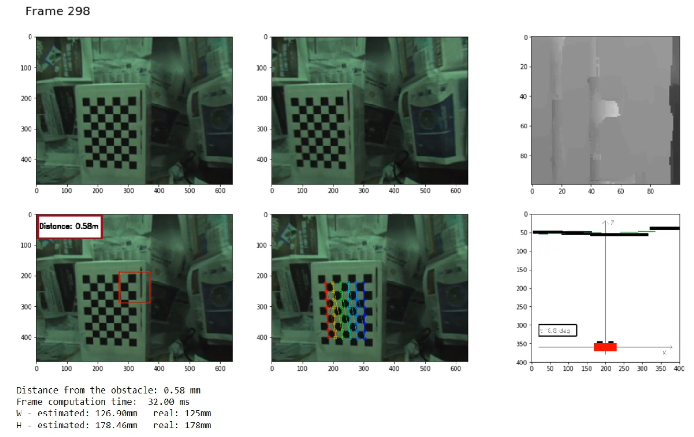

# Stereo Robot Navigation

Project work for the class Computer Vision M, UNIBO. The objective is to sense information concerning the space in front of the vehicle using a stereo camera setup.

<p align="center">
  
</p>


## Setup

Install the dependencies using conda:

```shell
conda env create -f environment.yml
```

